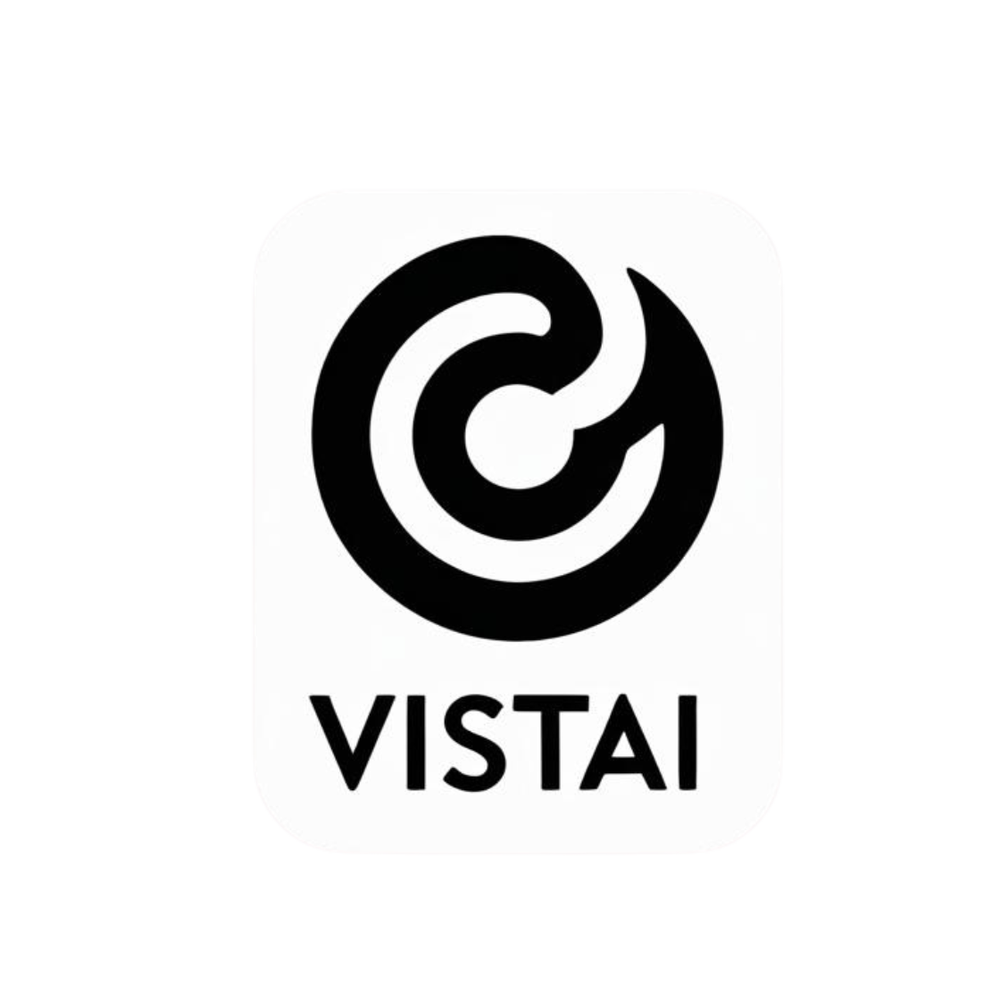

<div align="center">
  
  <h1>VistAI: Visual Search, Personalized for You.</h1>


</div>

## 🎥 Demo

<p align="center">
  
</p>

## Project Overview
VistAI is an advanced visual search and recommendation system that leverages state-of-the-art AI technologies to find visually similar products and provide personalized recommendations. The system combines computer vision (CLIP) for visual understanding and reinforcement learning (DQN) for intelligent recommendations.

## Features

- **Visual Search**: Find visually similar products using CLIP-based image embeddings
- **AI-Powered Recommendations**: Get personalized recommendations using Deep Q-Learning
- **Responsive Web Interface**: User-friendly interface for seamless interaction
- **Scalable Architecture**: Modular design for easy extension and maintenance

## Technology Stack

### Backend
- **Framework**: Flask
- **Computer Vision**: CLIP (Contrastive Language-Image Pretraining)
- **Similarity Search**: FAISS (Facebook AI Similarity Search)
- **Reinforcement Learning**: Stable Baselines3 (DQN)
- **Data Processing**: NumPy, Pandas, OpenCV
- **Deep Learning**: PyTorch

### Frontend
- HTML5, CSS3, JavaScript
- Responsive design for all devices

## Installation

### Prerequisites
- Python 3.8+
- pip
- Git

### Setup

1. Clone the repository:
   ```bash
   git clone https://github.com/Zeeshier/VistAI.git
   cd VistAI
   ```

2. Install dependencies:
   ```bash
   pip install -r requirements.txt
   ```

3. Download CLIP model:
   ```python
   import clip
   clip.load("ViT-B/32", download_root="models/clip_model")
   ```

4. Run the application:
   ```bash
   python src/app.py
   ```

5. Open your browser and navigate to `http://localhost:5000`

## Project Structure

```
VistAI/
├── data/                    # Dataset and processed images
├── models/                  # Pretrained models and embeddings
│   ├── clip_model/          # CLIP model weights
│   ├── dqn_model/           # Trained DQN models
│   └── embeddings/          # Image embeddings and FAISS index
├── src/                     # Source code
│   ├── app.py               # Flask application
│   ├── visual_search.py     # CLIP-based visual search
│   ├── rl_recommender.py    # DQN-based recommendation
│   ├── data_preprocessing.py# Image preprocessing utilities
│   └── utils.py             # Helper functions
├── static/                  # Static files (CSS, JS, uploads)
├── templates/               # HTML templates
├── tests/                   # Test files
├── requirements.txt         # Project dependencies
├── README.md                # Project Documentation
```


## Methodology


### 1. Visual Search with CLIP
- Utilizes OpenAI's CLIP model to generate image embeddings
- Implements FAISS for efficient similarity search
- Returns visually similar products based on input image

### 2. Reinforcement Learning Recommendations
- Implements Deep Q-Network (DQN) for personalized recommendations
- State space: CLIP embeddings of products
- Action space: Product indices
- Reward function: Positive for correct matches, negative for mismatches


## Implementation Details

### Visual Search Pipeline
1. **Image Preprocessing**: Resize and normalize input images
2. **Feature Extraction**: Generate embeddings using CLIP
3. **Similarity Search**: Find nearest neighbors using FAISS
4. **Result Ranking**: Sort results by similarity score

### RL Recommendation System
1. **Environment Setup**: Custom Gym environment for product recommendations
2. **Model Training**: Train DQN on product embeddings
3. **Inference**: Generate recommendations based on user queries

## Challenges Faced

1. **Performance Optimization**:
   - Implemented FAISS for efficient similarity search
   - Optimized CLIP model loading and inference

2. **Data Processing**:
   - Handled varying image sizes and formats
   - Implemented efficient batch processing

3. **Model Training**:
   - Addressed exploration-exploitation tradeoff in RL
   - Implemented reward shaping for better convergence

## Results

- **Visual Search**: High accuracy in finding visually similar products
- **Recommendation Quality**: Improved user engagement with personalized suggestions
- **Performance**: Fast response time for real-time recommendations


## Team

- **AI Engineers**: Zeeshan Ahmad(Team Lead), M Abeer(Team Member)
- **Web Developer**: Muhammad Hamza Sirang(Team Member)

## License

This project is licensed under the MIT License - see the [LICENSE](LICENSE) file for details.

## Acknowledgments

- OpenAI for the CLIP model
- Facebook Research for FAISS
- Stable Baselines3 team
- The open-source community for valuable libraries and tools
